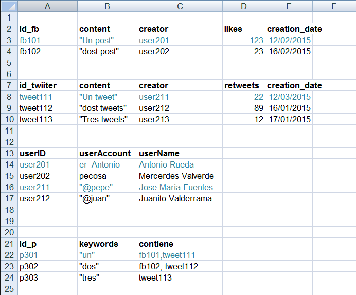

# Web de Datos 
# Ejercicio 1-2

- Autor: Juan A. García Cuevas
- Fecha: 06/06/2016

### Dado los datos que tenemos en Ejercicio1_2_data.xlsx:




### Crear un modelo RDF con serialización RDF/XML donde aparezcan los siguientes recursos descritos: “fb101”, “tweet111”, “user201”, “user211”, “p301” con su información asociada:

```xml
    <?xml version="1.0" encoding="UTF-8"?>

    <rdf:RDF
    xmlns:rdf="http://www.w3.org/1999/02/22-rdf-syntax-ns#"
    xmlns:dc="http://purl.org/dc/elements/1.1/"
    xmlns:dcterms="http://purl.org/dc/terms/"
    xmlns:sioc="http://rdfs.org/sioc/spec/"
    xmlns:myNameSpace="http://www.example.com/myprimerrdf#"
    xml:base="http://www.example.com/myprimerrdf"
    xmlsn:="http://www.example.com/myprimerrdf#">

	<rdf:Description rdf:about="http://www.example.com/myprimerrdf#fb101">
		<myNameSpace:content>Un post</myNameSpace:content>
		<myNameSpace:creator rdf:resource="http://www.example.com/myprimerrdf#user201"/>
		<myNameSpace:likes>123</myNameSpace:likes>
		<myNameSpace:creation_date>12/02/2015</myNameSpace:creation_date>
	</rdf:Description>

	<rdf:Description rdf:about="http://www.example.com/myprimerrdf#tweet111">
		<myNameSpace:content>Un tweet</myNameSpace:content>
		<myNameSpace:creator rdf:resource="http://www.example.com/myprimerrdf#user211"/>
		<myNameSpace:retweets>22</myNameSpace:retweets>
		<myNameSpace:creation_date>12/03/2015</myNameSpace:creation_date>
	</rdf:Description>

	<rdf:Description rdf:about="http://www.example.com/myprimerrdf#user201">
		<myNameSpace:userAccount>er_Antonio</myNameSpace:userAccount>
		<myNameSpace:userName>Antonio Rueda</myNameSpace:userName>
	</rdf:Description>

	<rdf:Description rdf:about="http://www.example.com/myprimerrdf#user211">
		<myNameSpace:userAccount>@pepe</myNameSpace:userAccount>
		<myNameSpace:userName>Jose Maria Fuentes</myNameSpace:userName>
	</rdf:Description>

	<rdf:Description rdf:about="http://www.example.com/myprimerrdf#p301">
		<myNameSpace:keywords>un</myNameSpace:keywords>
		<myNameSpace:contiene rdf:resource="http://www.example.com/myprimerrdf#fb101"/>
		<myNameSpace:contiene rdf:resource="http://www.example.com/myprimerrdf#tweet111"/>
	</rdf:Description>

    </rdf:RDF>
```

