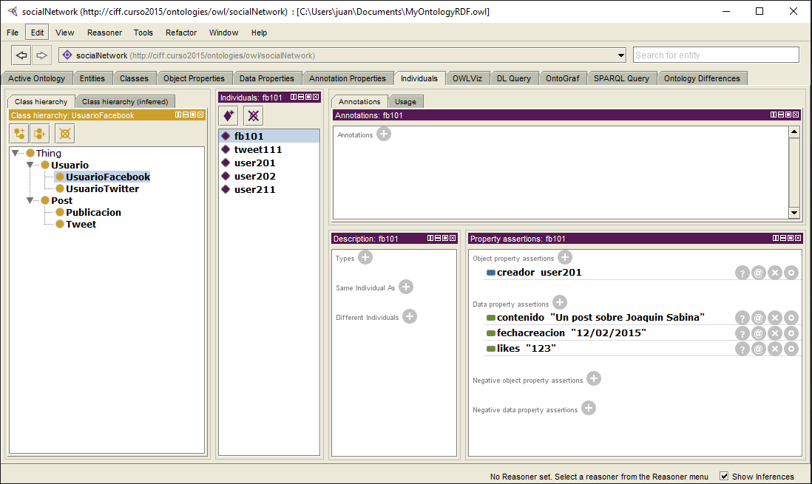

# Web de Datos 
# Ejercicio 2-4

- Autor: Juan A. García Cuevas
- Fecha: 08/06/2016

**Haciendo uso de la herramienta Protégé crear las siguientes clases y subclases**:

- La clase Usuario puede ser de dos tipo: Usuario de Twitter o Usuario de Facebook
- Un Post puede ser de dos tipos: Un Tweet o un Publicación (de facebook)

**Crear las siguientes propiedades (con su dominio y rango)**

- Un Usuario tiene una cuenta de usuario "user account"
- Un Usuario de Twitter tiene "followers" de tipo usuario de Twitter
- Un Usuario de Facebook tiene "friends" de tipo usuario de Facebook
- Un Post tiene una fecha de creación
- Un Post tiene un contenido
- Un Post tiene un creador que es de tipo Usuario
- Un Tweet tiene "retweets" que es un numero entero
- Una Publicación tiene "likes" que es un numero entero

**Crear las siguientes instancias y rellenar sus descripciones:**

- el user211 es una instancia de Usuario de Twitter
- el user211 tiene cuenta de usuario "@pepe"
- el user201 es una instancia de tipo Usuario de Facebook
- el user201 tiene cuenta de usuario "er_Antonio"
- el user202 es una instancia de tipo Usuario de Facebook
- el user202 tiene cuenta de usuario "pecosa"
- el user202 tiene como "friend" al user201
- tweet111 es una instancia de Tweet
- el tweet111 tiene el creador user211
- el tweet111 se creo el 12/03/2015
- el tweet111 tiene el contenido "Un tweet de Joaquín Sabina"
- el fb101 es una instancia de Publicación
- el fb101 tiene el creador user201
- el fb101 se creo el 12/02/2015
- el fb101 tiene el contenido "Un post sobre Joaquin Sabina"
- el fb101 tiene 123 "likes"

> Output: Fichero "Ejercicio2_4.owl"

> pD: para salvar un fichero a partir de Protégé: Files --> Save As --> RDF/XML

**Ficheros:**

- [Fichero de ontología en formato RDF](https://github.com/juangarciaciff/WebDatosEjercicios/blob/master/MyOntologyRDF.owl)
- [Fichero de ontología en formato Turtle](https://github.com/juangarciaciff/WebDatosEjercicios/blob/master/MyOntologyTURTLE.owl)

**Imagen de la alicación Protégé:**

