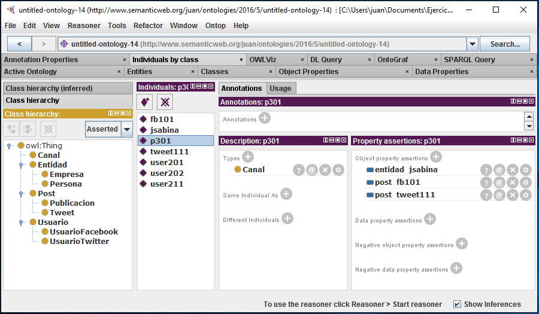

# Web de Datos 
# Ejercicio 2-5

- Autor: Juan A. García Cuevas
- Fecha: 19/06/2016

**Partiendo del ejercicio 2_4, añadir el siguiente conocimiento**:

**Crear las siguientes clases y subclases**:

- Un Canal para albergar post
- Una Entidad puede ser de tipo Persona o de tipo Empresa

**Crear las siguientes propiedades (con su dominio y rango)**:

- Un Canal puede almacenar Tweets o Publicaciones
- Un Canal es representado por Entidades

**Aadir los siguientes individuos y rellena sus propiedades**:

- Joaqun Sabina es una instancia de Persona
- el p301 es una instancia de Canal
- el p301 contiene al fb101 y al tweet111
- el p301 esta representado por Joaquin Sabina

>Output: Ejercicio 2_5.owl

**Ficheros:**

- [Ejercicio2_5.owl](https://github.com/juangarciaciff/WebDatosEjercicios/blob/master/datos/Ejercicio2_5.owl)

- [Ejercicio2_5.rdf](https://github.com/juangarciaciff/WebDatosEjercicios/blob/master/datos/Ejercicio2_5.rdf)

**Imagen de la aplicación Protégé:**

