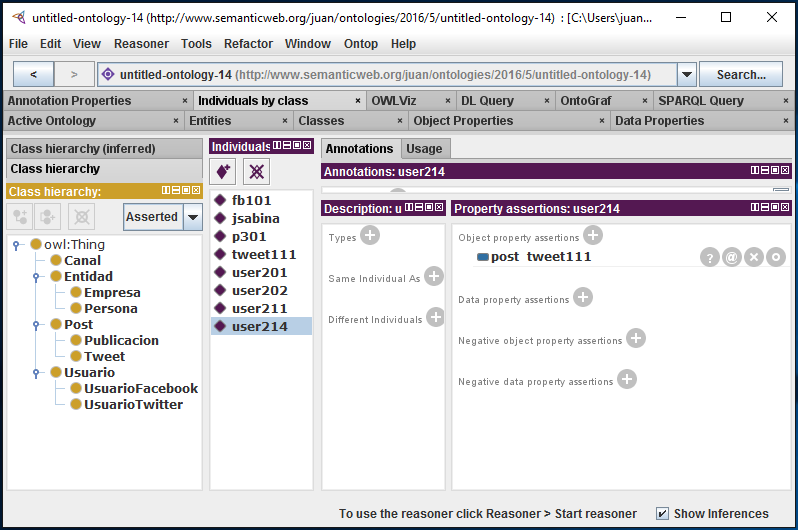

# Web de Datos 
# Ejercicio 2-6

- Autor: Juan A. García Cuevas
- Fecha: 19/06/2016

**A partir de la ontología definida en el ejercicio 2.4, añadir el siguiente conocimiento**:

- Crear una nueva instancia user214 (sin asignar clases)
- añadir que “el tweet111” tiene creador “user214”

**Aplicando el razonador sacar**:

- Ver la categoría inferida de la instancia user214
- Ver las instancias explicitas e inferidas de la clase User

>Para ello se hara uso del razonador de la siguiente manera: Reasoner --> Hermit --> Start reasoner

>Al aplicar el razonador, primero intentara determinar que la ontologia y las instancias definidas están correctamente definidas, y luego procederá a la inferencia de nuevo conocimiento.

**Ficheros**:

- [Ejercicio2_6.owl](https://github.com/juangarciaciff/WebDatosEjercicios/blob/master/datos/Ejercicio2_6.owl)

- [Ejercicio2_6.rdf](https://github.com/juangarciaciff/WebDatosEjercicios/blob/master/datos/Ejercicio2_6.rdf)

**Imagen de la aplicación Protégé:**

