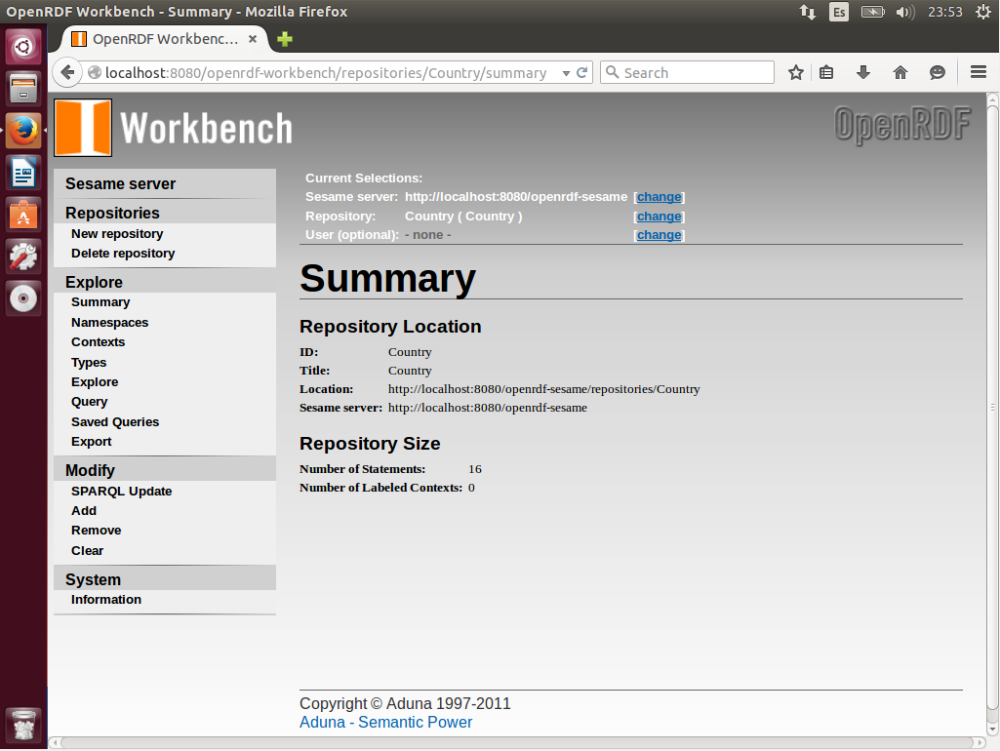
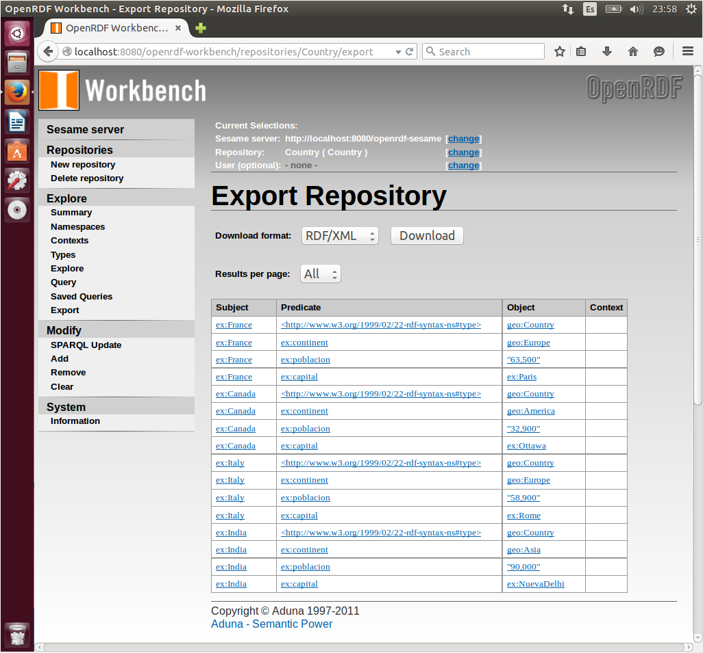

# Web de Datos 
# Ejercicio 3-2

- Autor: Juan A. García Cuevas
- Fecha: 08/06/2016

###Para el fichero Country.n3 que se encuentran en la carpeta de Data: 

- Crear un repositorio en sesame 
	- New repository 
	- In memory store 
	- añadirle el ID (Country) 
	- añadirle el titulo 
- Añadir los ficheros RDF en formato Turtle 
	- Add 
	- Y probamos que se ha cargado bien obteniendo estos resultados: 
		- Country.n3 
			- Number of Statements                     16 
			- Number of Labeled Contexts                0 

