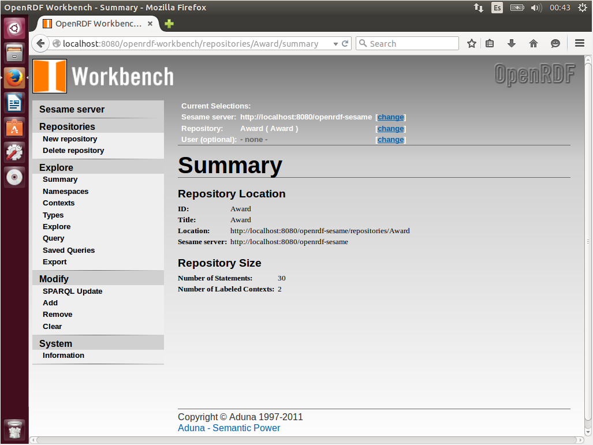
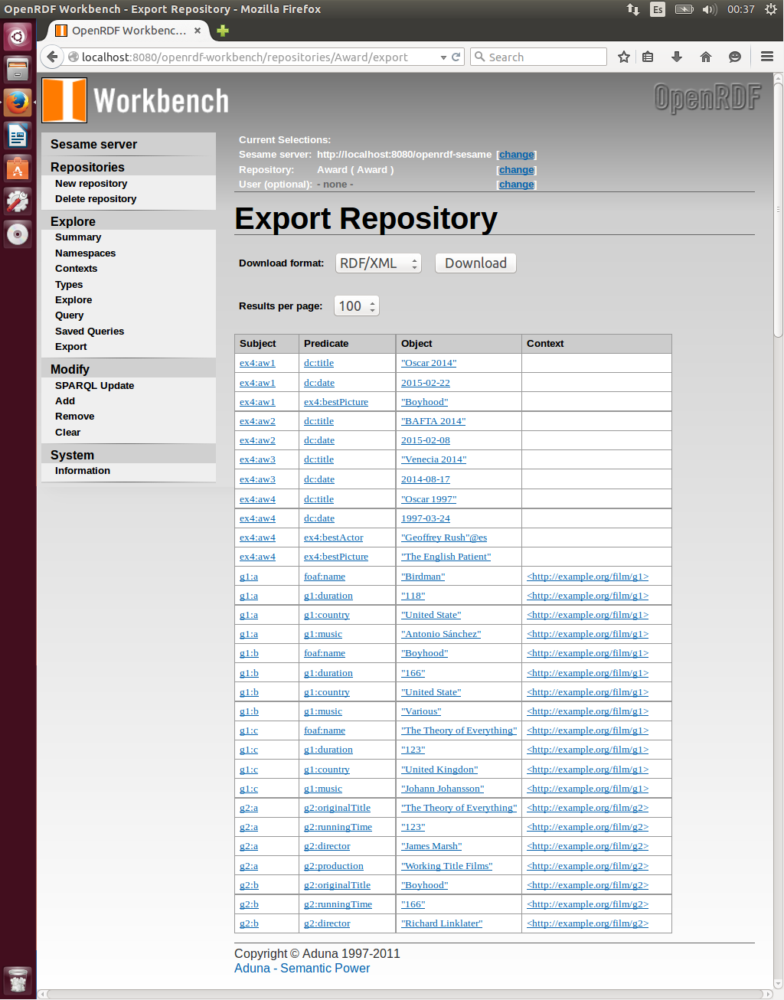

# Web de Datos 
# Ejercicio 3-3

- Autor: Juan A. García Cuevas
- Fecha: 08/06/2016

###Crear un repositorio “Award” añadiendo: 

- las tripletas de Award.n3 al grafo por defecto 
- Las tripletas de Graph1.n3 a un grafo nombrado con URI (context): http://example.org/film/g1
- Las tripletas de Graph2.n3 a un grafo nombrado con URI (context): http://example.org/film/g2
- Recordar que:
	- “Contex” sirve para indicar a que grafo vamos a cargas las tripletas: 
		- si no especificamos nada en “context” -> grafo por defecto 
		- Añadiendo la URI en el campo “Base URI” y marcando el check “use base URI as context identifier” -> se crea un grafo nombrado, que tiene como nombre la URI introducida.
	- Y probamos que se ha cargado bien obteniendo estos resultados:
		- Award.n3
			- Number of Statements             11
			- Number of Labeled Contexts        0
		- Graph1.n3
			- Number of Statements             23
			- Number of Labeled Contexts        1
		- Graph2.n3
			- Number of Statements             30
			- Number of Labeled Contexts        2   

