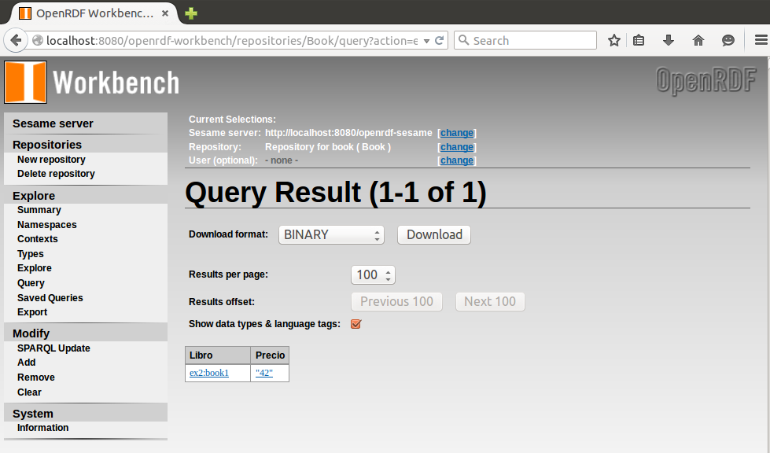

***
# Web de Datos - Ejercicio 4-6
***
- Autor: Juan A. García Cuevas
- Fecha: 06/07/2016
***

## Ejercicio 4_6:

- AGREGADOS: ¿Cuál es el libro más caro? (grafo libros):

```sparql
    PREFIX ex2:<http://example.org/book/>
    SELECT ?libro ?precio
    WHERE {
        ?libro ex2:price ?precio
    }
    ORDER BY DESC(?price) LIMIT 1
```



***


