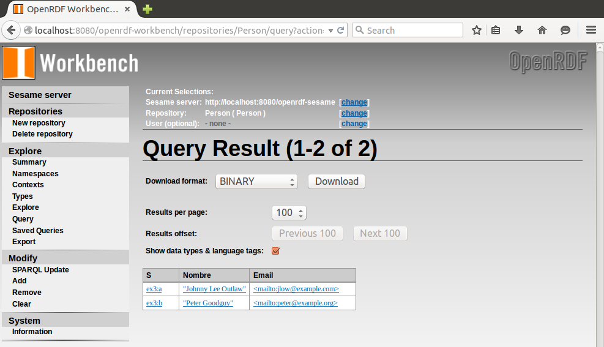
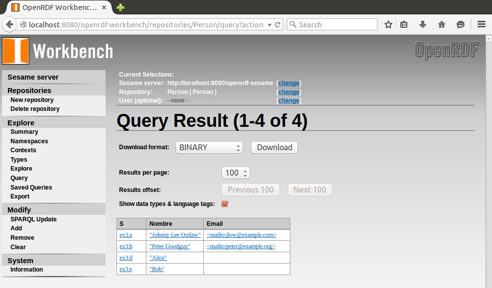
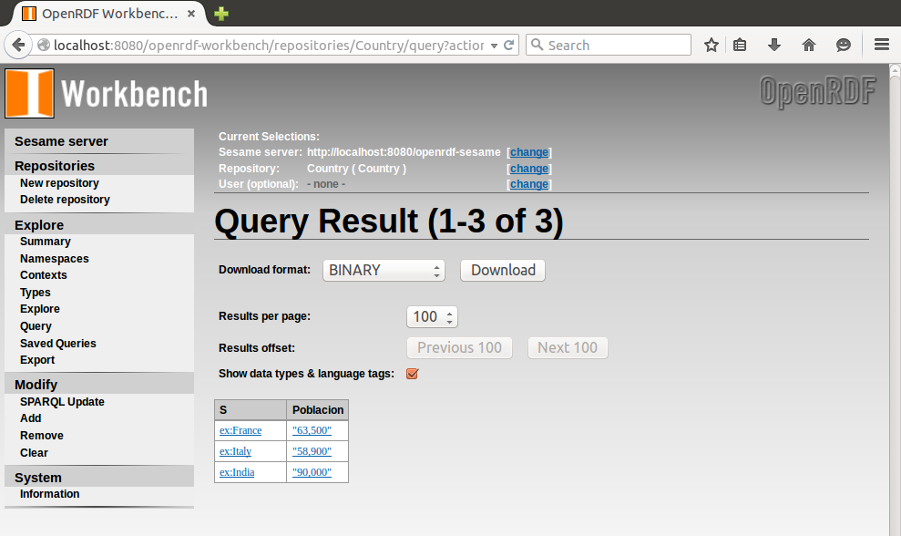
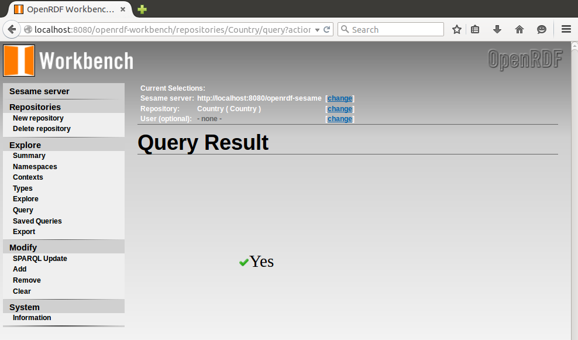
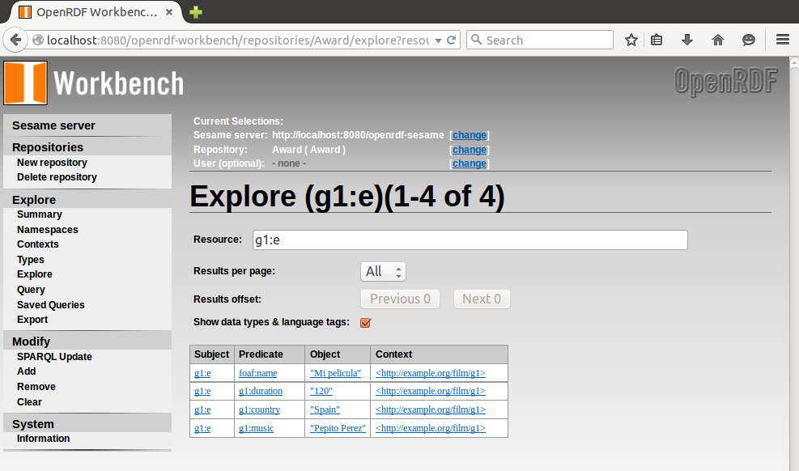
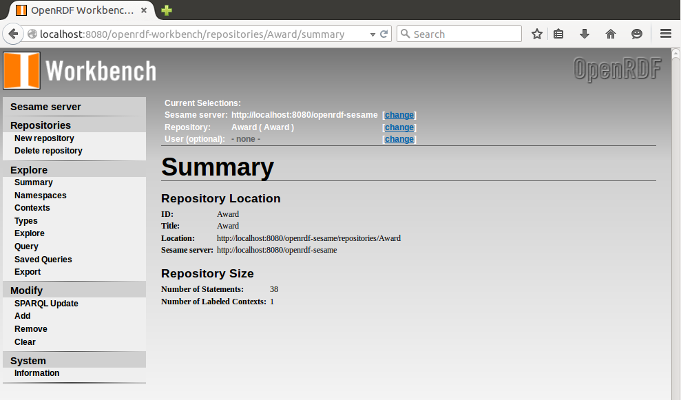
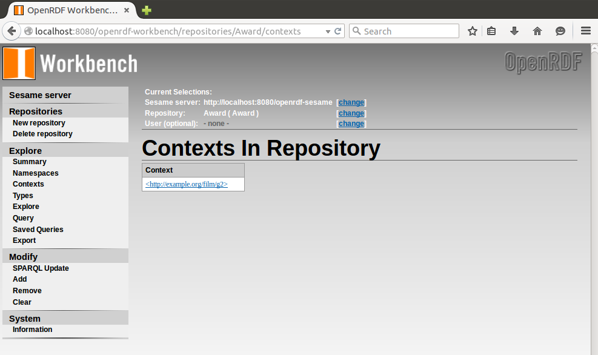

***
# Web de Datos - SPARQL Básico
***
- Autor: Juan A. García Cuevas
- Fecha: 02/07/2016
***

- En una ventana del navegador web:
    - Entrar en la página web del cliente "openrdf-workbench" instalado para nuestro servidor "Sesame" local:
        - [http://localhost:8080/openrdf-workbench/](http://localhost:8080/openrdf-workbench/)

## 1) Ejercicio 4_1: SELECT

- Dame aquellas personas que tengan nombre y email (grafo personas):
    - Acceder al menú "Repositories" y seleccionar el repositorio "Person".
    - Acceder al menú "Query", escribir la query siguiente y pulsar [Execute].

```sparql
        PREFIX foaf:<http://xmlns.com/foaf/0.1/>

        SELECT ?s ?nombre ?email
        WHERE {
            ?s foaf:name ?nombre.
            ?s foaf:mbox ?email
        }
```



## 2) Ejercicio 4_2: OPTIONAL

- Saca el nombre de las personas y si se puede su email (grafo personas)
    - Acceder al menú "Repositories" y seleccionar el repositorio "Person".
    - Acceder al menú "Query", escribir la query siguiente y pulsar [Execute].

```sparql
        PREFIX foaf:<http://xmlns.com/foaf/0.1/>

        SELECT ?s ?nombre ?email
        WHERE {
            ?s foaf:name ?nombre.
            OPTIONAL {?s foaf:mbox ?email}
        }
```



## 3) Ejercicio 4_3: FILTROS

- Cuales son los países que tienen una población superior a 40,000 habitantes (grafo países)
    - Acceder al menú "Repositories" y seleccionar el repositorio "Country".
    - Acceder al menú "Query", escribir la query siguiente y pulsar [Execute].

```sparql
        PREFIX ex:<http://example.org/country/>
        PREFIX geo:<http://www.w3.org/2003/01/geo/wgs84_pos#>
        PREFIX rdf:<http://www.w3.org/1999/02/22-rdf-syntax-ns#>

        SELECT ?s ?poblacion
        WHERE {
            ?s ex:poblacion ?poblacion.
            ?s rdf:type geo:Country
            FILTER (?poblacion > "40,000")
        }
```



## 4) Ejercicio 4_4: ASK/FILTERS

- Crea una query para preguntar ¿Tiene mas población Francia que Canadá? (grafo países)
    - Acceder al menú "Repositories" y seleccionar el repositorio "Country".
    - Acceder al menú "Query", escribir la query siguiente y pulsar [Execute].

```sparql
        PREFIX ex:<http://example.org/country/>

        ASK {
            ex:France ex:poblacion ?a.
            ex:Canada ex:poblacion ?b
            FILTER (?a > ?b) 
        }

```



## 5) Ejercicio 4_5: UPDATE (CLEAR, CREATE, LOAD): (grafo Award)

- Añade una nueva película al grafo por defecto
    - Acceder al menú "Repositories" y seleccionar el repositorio "Award".
    - Acceder al menú "SPARQL Update", escribir la query siguiente y pulsar [Execute].

```sparql
        PREFIX foaf:<http://xmlns.com/foaf/0.1/>
        PREFIX g1:<http://example.org/film/g1/>

        INSERT DATA {
        	g1:m foaf:name "Mi pelicula";
        	     g1:duration "120";
        	     g1:country "Spain";
        	     g1:music "Pepito Perez" .
        }
```


- _Para añadir una nueva película al grafo g1_:
    - Acceder al menú "Repositories" y seleccionar el repositorio "Award".
    - Acceder al menú "SPARQL Update", escribir la query siguiente y pulsar [Execute].

```sparql
        PREFIX foaf:<http://xmlns.com/foaf/0.1/>
        PREFIX g1:<http://example.org/film/g1/>

        INSERT DATA {
        	GRAPH <http://example.org/film/g1> {
        		g1:e foaf:name "Mi pelicula";
        		     g1:duration "120";
        		     g1:country "Spain";
        		     g1:music "Pepito Perez" .
        	}
        }
```



- Elimina el grafo 1 (uri: http://example.org/film/g1) del dataset de award (clear graph)
    - Acceder al menú "Repositories" y seleccionar el repositorio "Award".
    - Acceder al menú "SPARQL Update", escribir la query siguiente y pulsar [Execute].

```sparql
        PREFIX g1: <http://example.org/film/g1/>
        CLEAR GRAPH <http://example.org/film/g1>
```





***

